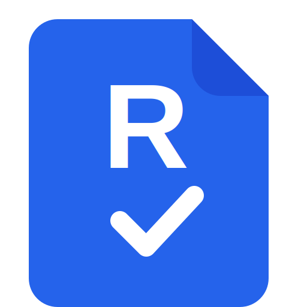

<p align="center">
  
</p>

<h1 align="center">Revdoku</h1>

<p align="center">
  <strong>AI-powered document inspection &amp; compliance review. Self-hosted. Open source.</strong>
</p>

<p align="center">
  <a href="https://revdoku.com"></a>
  <a href="LICENSE"></a>
  
  
</p>

<p align="center">
  Upload a PDF or image. Define (or auto-generate) a checklist of things to verify.
  Revdoku runs the document through an AI model, produces page-accurate visual highlights
  for each issue, and lets you export a shareable report.
</p>

---

## Features

- **Pinpoint review against your checklists.** Each rule lands a highlight on the exact line, number, or clause it flags.
- **Built for long documents.** Page-by-page, batched AI calls — a 150-page contract stays responsive.
- **Cross-document checks.** Attach a quote, an amendment, or a policy and the AI reasons across them.
- **Revision-aware.** Upload a new version; Revdoku tracks what changed and what you've already reviewed.
- **No issue forgotten.** Past failed checks carry forward to the next revision automatically.
- **Keyboard-first.** Hotkey navigation, rapid page flipping, one-keystroke pass/fail.
- **Shareable reports.** Export PDF or HTML with every finding rendered inline on the page.
- **Optional data extraction.** Pull amounts, line items, or any structured value into CSV.
- **Scriptable checks.** Run custom scripts over extracted values for math the AI shouldn't guess at.

---

## See it in action

Drop a document, run a checklist, read the report. A few demos:

| Legal | Healthcare | Finance |
|---|---|---|
| [](https://www.youtube.com/watch?v=SvUzAIfdSp4)<br/>**Mutual NDA review** | [](https://www.youtube.com/watch?v=Rnvn3U7JQhQ)<br/>**Vital signs extraction** | [](https://www.youtube.com/watch?v=co3R2eEmhJA)<br/>**Invoice review** |
| [](https://www.youtube.com/watch?v=fXzRPfyqjvU)<br/>**Investor letter (Buffett checklist)** | [](https://www.youtube.com/watch?v=CkKd9a-Mudk)<br/>**AI-written blog detection** | [](https://www.youtube.com/watch?v=GJI20s2kt6Q)<br/>**Hand-drawn chart extraction** |

Full library of 18 walkthroughs → [docs/demos.md](docs/demos.md). Playlist on YouTube → <https://www.youtube.com/playlist?list=PLoSGpfRUg7ywQ7kbEiCuXNI5nN-CRxbZe>.

---

## Quick start

**You'll need** [Docker Desktop](https://www.docker.com/products/docker-desktop/) (or Docker Engine on Linux) and [Git](https://git-scm.com/downloads). Works on macOS, Linux, and **Windows (open WSL Ubuntu — the steps are identical there).**

1. **Open a terminal.**
   - macOS → Terminal app
   - Windows → Start menu → "WSL" (install with `wsl --install` in PowerShell if you haven't)
   - Linux → any terminal
2. **Clone and enter the repo:**
   ```bash
   git clone https://github.com/revdoku/revdoku.git
   cd revdoku
   ```
3. **Create your config file:**
   ```bash
   cp env.example .env.local
   ```
   The filename starts with a dot — that makes it hidden in some file managers. Use `ls -la` in the terminal, or enable "Show hidden files" in your file browser to see it.
4. **Open `.env.local`** in any plain-text editor (VS Code, TextEdit, Notepad, nano …) and fill in every line marked `[REQUIRED]`. Step-by-step instructions are inside the file, including the `openssl` commands that generate the four random secrets.
5. **Start it:**
   ```bash
   ./bin/start
   ```
   Preflight checks run first (Docker installed? running? secrets filled?) with plain-English errors if anything's missing. The first run downloads the prebuilt image (`ghcr.io/revdoku/revdoku-app:latest`, ~1 GB) — be patient.
6. Open <http://localhost:3000> and sign in with the `REVDOKU_BOOTSTRAP_ADMIN_EMAIL` and `REVDOKU_BOOTSTRAP_ADMIN_PASSWORD` you just set.

**AI provider keys** (OpenAI, Anthropic, Google, OpenRouter, …) are set **inside the app**, not in `.env.local`. After signing in, go to **Account → AI → Providers** and paste your key — Revdoku encrypts it per-account.

To rebuild from source instead of pulling the prebuilt image: `./bin/start --build`.

---

## Configuration

All configuration is environment variables. See `env.example` for the complete list with inline docs. Required minimums:

| Variable | Purpose |
|---|---|
| `SECRET_KEY_BASE` | Rails session/cookie signing. |
| `LOCKBOX_MASTER_KEY` | Encrypts every sensitive field. Rotate = data unreadable. |
| `PREFIX_ID_SALT` | Seeds public-URL hashids. Rotate = all public URLs change. |
| `REVDOKU_DOC_API_KEY` | Internal Rails ↔ doc-api auth. Any random string. |
| `REVDOKU_BOOTSTRAP_ADMIN_EMAIL` / `_PASSWORD` | First admin, seeded on first boot. |

Recommended extras:

| Variable | Purpose |
|---|---|
| `ACTIVE_STORAGE_SERVICE=amazon` + `AWS_*` | Offload uploads to S3-compatible storage. |
| `SMTP_SERVER` + `SMTP_*` | Outbound email (confirmations, resets). Mailer no-ops if unset. |
| `REVDOKU_LOGIN_MODE=password_no_confirmation` | Skip email confirmation — recommended for airgapped/single-user installs. |
| `LOCKBOX_PREVIOUS_MASTER_KEY` | Decrypt old data during master-key rotation. |

---

## Security

- All uploaded files and sensitive data fields encrypted at rest with AES-256-GCM. SQLite uses WAL mode.
- CSRF + rate limits on authentication endpoints out of the box.
- No telemetry.

Report issues privately: **[security@revdoku.com](mailto:security@revdoku.com)** — please don't open a public GitHub issue.

---

## Contributing

Bug reports and PRs welcome. Read `CLAUDE.md` at the repo root for architecture, naming conventions, and layout. For larger changes, open a GitHub Discussion first so we can align on scope.

---

## License

Revdoku is released under the **[GNU Affero General Public License v3.0](LICENSE)** (AGPL-3.0). For commercial licensing, contact **[support@revdoku.com](mailto:support@revdoku.com)**.

---

Hosted version: <https://revdoku.com> · Issues & bugs: GitHub Issues
